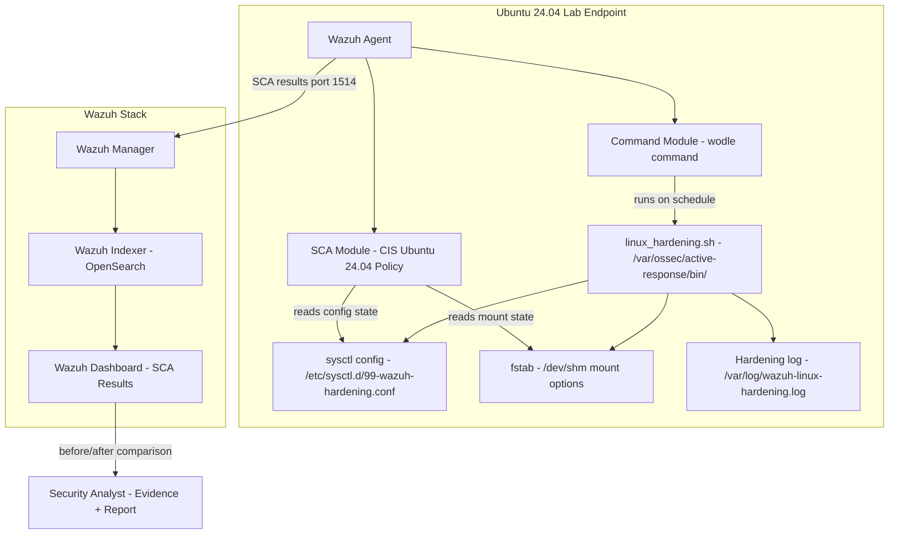

# 🛡️ Automated Linux Endpoint Hardening with Wazuh

> Using Wazuh Command Module and SCA to Remediate Linux Configuration Drift

A lab-based Linux hardening automation project that uses **Wazuh Security Configuration Assessment (SCA)** to measure baseline security posture, identifies CIS benchmark failures on an Ubuntu 24.04 endpoint, and automatically applies targeted remediations via the **Wazuh Command Module** — tracking before-and-after SCA score improvement with full evidence documentation.

> **Lab Executed:** Apr 27, 2026 · Host: `ubuntu-server` · Ubuntu 24.04.4 LTS · Wazuh v4.14.5 · VMware Workstation  
> SCA score improved from **50% → 51%** with 5 controls remediated via Wazuh Command Module.  
> Idempotency confirmed across 2 execution cycles (Run 1: Changed 8 · Run 2: Changed 0).

---

## 📌 Why This Project Matters

Most SIEM deployments focus exclusively on detection — alerting when something goes wrong. This project demonstrates a different capability: using Wazuh not just to monitor, but to **actively improve** endpoint security posture through automated, controlled, and auditable hardening.

Configuration drift is silent and constant. A server that passed a CIS benchmark scan six months ago may have dozens of regressions today due to package updates, manual changes, or application requirements. Without continuous assessment and automated remediation, drift accumulates unnoticed.

This project shows how to:
- Measure the problem (SCA baseline scoring)
- Automate the fix (idempotent hardening scripts via Command Module)
- Validate the improvement (before/after SCA comparison)
- Document the evidence (compliance-ready report)

> **This is a lab-based portfolio project.** All scripts are designed for isolated Ubuntu 24.04 lab environments. Do not apply to production without change management review, application compatibility testing, and system owner approval.

---

## 🧪 Lab Overview

| Component | Role |
|-----------|------|
| Wazuh Manager | Policy processing, Command Module orchestration, alert generation |
| Wazuh Indexer | SCA event and alert storage (OpenSearch) |
| Wazuh Dashboard | SCA results visualization and before/after comparison |
| Ubuntu 24.04 Endpoint | Hardening target running Wazuh Agent |
| Wazuh SCA Module | Runs CIS benchmark checks; measures configuration compliance |
| Wazuh Command Module | Executes hardening script automatically on schedule |
| linux_hardening.sh | Idempotent hardening script — sysctl + mount options |
| validate_hardening_state.sh | Manual validation evidence collection |
| CIS Ubuntu 24.04 Policy | Built-in Wazuh SCA policy (cis_ubuntu24-04.yml) |

---

## 🏗️ Architecture Diagram



---

## 🔄 Hardening Workflow

| Step | Action | Tool | Output |
|------|--------|------|--------|
| 1 | Measure initial SCA baseline | Wazuh SCA | Score + failed checks list |
| 2 | Identify safe remediations | Analyst review | Controls scope |
| 3 | Deploy hardening script | Manual / Agent Group | Script on endpoint |
| 4 | Configure Command Module | ossec.conf wodle | Scheduled execution |
| 5 | Script runs on agent start/schedule | Wazuh Command Module | Hardened config |
| 6 | Validate changes manually | validate_hardening_state.sh | Validation table |
| 7 | SCA re-scan runs automatically | Wazuh SCA | Updated results |
| 8 | Compare before/after | Wazuh Dashboard | Score improvement |
| 9 | Collect evidence | collect_sca_evidence.sh | Evidence file |
| 10 | Generate report | Manual | Compliance report |

---

## 🎯 Hardening Scope (Lab)

| Control | sysctl / Config | CIS Area | Risk Reduced |
|---------|----------------|---------|-------------|
| LH-001 | /dev/shm noexec,nodev,nosuid | Filesystem | Prevent execution from shared memory |
| LH-002 | net.ipv4.conf.all.send_redirects=0 | Network | Route manipulation |
| LH-003 | net.ipv4.ip_forward=0 | Network | Unintended routing |
| LH-004 | net.ipv4.conf.all.accept_source_route=0 | Network | IP spoofing |
| LH-005 | net.ipv4.conf.all.accept_redirects=0 | Network | ICMP route manipulation |
| LH-006 | net.ipv4.conf.all.secure_redirects=0 | Network | Trusted ICMP redirect abuse |

---

## 📁 Repository Structure

```
Automation Linux Endpoint Hardening/
├── README.md
├── LICENSE
├── docs/
│   ├── 01-overview.md
│   ├── 02-lab-architecture.md
│   ├── 03-linux-hardening-concept.md
│   ├── 04-wazuh-command-module.md
│   ├── 05-wazuh-sca-and-cis-benchmark.md
│   ├── 06-hardening-script-design.md
│   ├── 07-policy-and-remediation-scope.md
│   ├── 08-deployment-guide.md
│   ├── 09-automated-remediation-workflow.md
│   ├── 10-sca-score-before-after.md
│   ├── 11-compliance-mapping.md
│   ├── 12-dashboard-review.md
│   ├── 13-rollback-and-change-control.md
│   ├── 14-troubleshooting.md
│   ├── 15-security-considerations.md
│   └── 16-improvement-ideas.md
├── scripts/
│   ├── linux_hardening.sh
│   ├── linux_hardening_dry_run.sh
│   ├── linux_hardening_rollback.sh
│   ├── validate_hardening_state.sh
│   └── collect_sca_evidence.sh
├── wazuh/
│   ├── agent-command-module-snippet.xml
│   ├── centralized-agent-config-snippet.xml
│   └── active-response-permission-notes.md
├── hardening/
│   ├── controls-matrix.md
│   ├── cis-ubuntu-24.04-lab-controls.md
│   └── remediation-checklist.md
├── samples/
│   ├── sample-sca-before-result.json
│   ├── sample-sca-after-result.json
│   ├── sample-sca-status-change-alert.json
│   ├── sample-command-module-log.log
│   └── sample-hardening-run-output.log
├── reports/
│   ├── sample-linux-hardening-assessment-report.md
│   └── sample-before-after-sca-score-report.md
└── screenshots/
    ├── README.md
    └── *.png
```

---

## ⚙️ Requirements

- Wazuh Server v4.x (OVA or self-hosted) — *lab used v4.14.5*
- Ubuntu 24.04 LTS endpoint with Wazuh Agent enrolled — *lab used Ubuntu 24.04.4 LTS*
- Root / sudo access on both endpoint and Wazuh Manager
- CIS Ubuntu 24.04 SCA policy available in Wazuh (built-in)
- `wazuh_command.remote_commands=1` set in `/var/ossec/etc/local_internal_options.conf`
- VM snapshot taken **before** running hardening scripts
- Isolated lab network (VMware host-only or NAT)

---

## 🚀 Step-by-Step Guide

### Step 1 — Take VM Snapshot

Sebelum melakukan apapun, ambil snapshot VM endpoint sebagai rollback plan utama.

```bash
# Dilakukan via hypervisor GUI
# VMware: VM → Snapshot → Take Snapshot
# Beri nama: pre-hardening-baseline-YYYY-MM-DD
# Deskripsi: Baseline SCA <score>%, <jumlah failed> failed, before hardening
```

> ⚠️ Jangan lewatkan langkah ini. Snapshot adalah rollback plan paling cepat dan deterministik kalau hardening menghasilkan efek samping yang tidak terduga.

---

### Step 2 — Enable Remote Commands di Wazuh Agent

Wazuh Agent secara default memblok eksekusi command lokal (security default). Aktifkan sebelum mengkonfigurasi Command Module.

```bash
# Di Ubuntu endpoint, sebagai root
echo "wazuh_command.remote_commands=1" >> /var/ossec/etc/local_internal_options.conf

# Verifikasi
grep "remote_commands" /var/ossec/etc/local_internal_options.conf
# Expected: wazuh_command.remote_commands=1
```

---

### Step 3 — Cek Baseline SCA Score

Trigger SCA scan dan catat score awal sebagai "before evidence".

```bash
# Restart agent untuk trigger scan_on_start
systemctl restart wazuh-agent

# Tunggu ~2-3 menit, cek apakah scan sudah selesai
grep "sca:" /var/ossec/logs/ossec.log | tail -5
# Cari baris: "Security Configuration Assessment scan finished"
```

Buka Wazuh Dashboard dan catat baseline:
```
Endpoint Security → Configuration Assessment
→ Pilih agent → CIS Ubuntu Linux 24.04 LTS Benchmark
→ Catat: Score, Passed, Failed, Not Applicable
→ Screenshot halaman summary (before evidence)
→ Search per-control target untuk konfirmasi statusnya Failed
```

---

### Step 4 — Deploy Hardening Script

Copy script ke direktori Active Response Wazuh dengan permission yang ketat.

```bash
# Dari folder project, sebagai root
cp scripts/linux_hardening.sh /var/ossec/active-response/bin/

# Set ownership dan permission — WAJIB tepat
chown root:wazuh /var/ossec/active-response/bin/linux_hardening.sh
chmod 750 /var/ossec/active-response/bin/linux_hardening.sh

# Verifikasi — output HARUS: -rwxr-x--- 1 root wazuh
ls -la /var/ossec/active-response/bin/linux_hardening.sh
```

> **Kenapa `root:wazuh 750`?** Owner `root` memastikan hanya root yang bisa modifikasi script. Group `wazuh` memberi Wazuh Agent hak eksekusi. Permission `750` memastikan tidak ada user lain yang bisa baca atau jalankan script tersebut.

---

### Step 5 — Dry Run (Wajib Sebelum Apply)

Preview perubahan yang akan dilakukan script **tanpa apply apapun** ke sistem.

```bash
# Jalankan dry run (read-only)
bash scripts/linux_hardening_dry_run.sh

# Simpan output sebagai evidence
bash scripts/linux_hardening_dry_run.sh | tee ~/dry-run-evidence-$(date +%F).log
```

Review output — pastikan:
- Hanya 6 control LH-001 s/d LH-006 yang disebut
- Tidak ada perubahan SSH, user management, atau firewall rules
- Jumlah NON-COMPLIANT sesuai dengan baseline yang dicatat di Step 3

---

### Step 6 — Configure Wazuh Command Module

Backup config lama, lalu tambahkan wodle block untuk mengaktifkan scheduled execution.

```bash
# Backup ossec.conf
cp /var/ossec/etc/ossec.conf /var/ossec/etc/ossec.conf.bak

# Edit config
nano /var/ossec/etc/ossec.conf
```

Tambahkan blok berikut **tepat sebelum** tag penutup `</ossec_config>`:

```xml
<wodle name="command">
  <disabled>no</disabled>
  <tag>linux-hardening</tag>
  <command>/var/ossec/active-response/bin/linux_hardening.sh</command>
  <interval>12h</interval>
  <ignore_output>no</ignore_output>
  <run_on_start>yes</run_on_start>
  <timeout>120</timeout>
</wodle>
```

> Snippet lengkap dengan komentar tersedia di `wazuh/agent-command-module-snippet.xml`.

Parameter penting:
- `interval: 12h` — script jalan setiap 12 jam untuk correct drift
- `run_on_start: yes` — script langsung jalan saat agent start/restart
- `timeout: 120` — script di-kill jika jalan lebih dari 120 detik

---

### Step 7 — Restart Agent & Verifikasi Eksekusi

Karena `run_on_start: yes`, script langsung jalan otomatis setelah restart.

```bash
systemctl restart wazuh-agent
systemctl status wazuh-agent --no-pager
# Expected: Active: active (running)

# Tunggu 30 detik, cek hardening log
tail -50 /var/log/wazuh-linux-hardening.log
# Expected: baris [CHANGED] per sysctl + summary "Changed: X, Failed: 0"

# Cek juga agent log untuk korelasi Command Module
grep "linux-hardening" /var/ossec/logs/ossec.log | tail -10
```

---

### Step 8 — Validate Hardening State

Jalankan script validasi untuk cross-check independen bahwa semua control sudah applied.

```bash
# Jalankan validasi
bash scripts/validate_hardening_state.sh
# Expected: semua baris ✅ PASS

# Simpan output sebagai evidence
bash scripts/validate_hardening_state.sh | tee ~/validation-after-$(date +%F).log
```

Cross-check manual:

```bash
# Cek sysctl values langsung
sysctl net.ipv4.conf.all.send_redirects    # harus: 0
sysctl net.ipv4.conf.all.accept_redirects  # harus: 0
sysctl net.ipv4.conf.all.secure_redirects  # harus: 0

# Cek /dev/shm mount options
mount | grep shm
# Expected: ...nosuid,nodev,noexec...

# Cek file persistent config terbuat
cat /etc/sysctl.d/99-wazuh-hardening.conf
```

---

### Step 9 — Trigger SCA Re-scan & Bandingkan Score

```bash
# Restart agent untuk trigger scan_on_start
systemctl restart wazuh-agent

# Tunggu scan selesai (~2-3 menit)
grep "sca:" /var/ossec/logs/ossec.log | tail -5
# Expected: "Security Configuration Assessment scan finished"
```

Buka Dashboard dan bandingkan:
```
Endpoint Security → Configuration Assessment → <nama agent>
→ Catat score baru
→ Screenshot halaman summary (after evidence)
→ Search setiap control target — konfirmasi status changed ke Passed
```

---

### Step 10 — Collect Evidence & Generate Report

```bash
# Collect comprehensive evidence (system info, sysctl, mount, log, fstab, backup)
cd /path/to/project
bash scripts/collect_sca_evidence.sh
ls -la evidence/
# Output: evidence/linux-hardening-evidence-<timestamp>.txt

# Hash script untuk integrity proof
sha256sum /var/ossec/active-response/bin/linux_hardening.sh
```

Update laporan dengan data lab aktual:
- `reports/sample-before-after-sca-score-report.md` — isi angka before/after aktual
- `reports/sample-linux-hardening-assessment-report.md` — isi semua section dengan data lab
- `screenshots/` — masukkan semua screenshot sesuai panduan di `screenshots/README.md`

---

## 📊 Before/After SCA Score (Lab Results)

> Hasil lab aktual — dijalankan pada `ubuntu-server` · Apr 27, 2026 · CIS Ubuntu Linux 24.04 LTS Benchmark v1.0.0

| Metric | Before Hardening | After Hardening | Change |
|--------|-----------------|----------------|--------|
| SCA Score | 50% | 51% | +1% |
| Passed Checks | 119 | 123 | +4 |
| Failed Checks | 118 | 114 | −4 |
| Not Applicable | 42 | 42 | — |
| Remediated Controls | 0 | 5 | +5 |
| Script Executions | — | 2 (idempotent) | — |

> **Note:** Check 35612 (`ensure icmp redirects are not accepted`) masih Failed karena CIS policy mengevaluasi interface IPv6 (`net.ipv6.conf.*`) dan loopback (`lo`) yang belum di-cover script ini. Detail dan rencana fix tersedia di `docs/16-improvement-ideas.md`.

---

## 🗺️ Compliance Mapping

| Framework | Relevant Controls | Coverage |
|-----------|-----------------|---------|
| CIS Controls | Secure Configuration, Continuous Vuln Mgmt | Partial |
| CIS Ubuntu 24.04 | Network hardening, Filesystem hardening | Partial |
| ISO 27001 | A.8.8, A.8.9, A.8.20 | Contextual |
| PCI DSS | Req 1 (Network), Req 2 (Secure config) | Contextual |

---

## 📚 References

- [Wazuh Blog: Automating Linux Endpoint Hardening with Wazuh](https://wazuh.com/blog/automating-linux-endpoint-hardening-with-wazuh/)
- [Wazuh Command Module Documentation](https://documentation.wazuh.com/current/user-manual/reference/ossec-conf/wodle-command.html)
- [Wazuh SCA Documentation](https://documentation.wazuh.com/current/user-manual/capabilities/sec-config-assessment/)
- [CIS Ubuntu Linux 24.04 Benchmark](https://www.cisecurity.org/benchmark/ubuntu_linux)
- [Linux sysctl security parameters](https://www.kernel.org/doc/html/latest/admin-guide/sysctl/)

---

## ⚖️ Disclaimer

Lab and portfolio use only. All hardening scripts are designed for isolated lab environments. Do not apply to production endpoints without change management approval, application compatibility testing, system owner authorization, and a validated rollback plan.

---

## 👤 Author

**Dimasqi Ramadhani** · Security Engineer