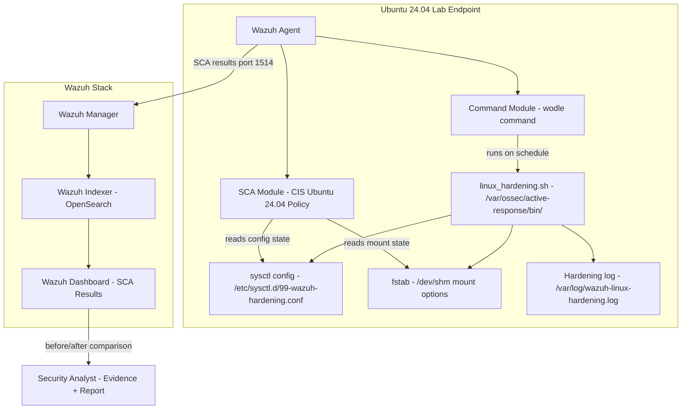

# 🛡️ Automated Linux Endpoint Hardening with Wazuh

> Using Wazuh Command Module and SCA to Remediate Linux Configuration Drift

A lab-based Linux hardening automation project that uses **Wazuh Security Configuration Assessment (SCA)** to measure baseline security posture, identifies CIS benchmark failures on an Ubuntu 24.04 endpoint, and automatically applies targeted remediations via the **Wazuh Command Module** — tracking before-and-after SCA score improvement with full evidence documentation.

---

## 📌 Why This Project Matters

Most SIEM deployments focus exclusively on detection — alerting when something goes wrong. This project demonstrates a different capability: using Wazuh not just to monitor, but to **actively improve** endpoint security posture through automated, controlled, and auditable hardening.

Configuration drift is silent and constant. A server that passed a CIS benchmark scan six months ago may have dozens of regressions today due to package updates, manual changes, or application requirements. Without continuous assessment and automated remediation, drift accumulates unnoticed.

This project shows how to:
- Measure the problem (SCA baseline scoring)
- Automate the fix (idempotent hardening scripts via Command Module)
- Validate the improvement (before/after SCA comparison)
- Document the evidence (compliance-ready report)

> **This is a lab-based portfolio project.** All scripts are designed for isolated Ubuntu 24.04 lab environments. Do not apply to production without change management review, application compatibility testing, and system owner approval.

---

## 🧪 Lab Overview

| Component | Role |
|-----------|------|
| Wazuh Manager | Policy processing, Command Module orchestration, alert generation |
| Wazuh Indexer | SCA event and alert storage (OpenSearch) |
| Wazuh Dashboard | SCA results visualization and before/after comparison |
| Ubuntu 24.04 Endpoint | Hardening target running Wazuh Agent |
| Wazuh SCA Module | Runs CIS benchmark checks; measures configuration compliance |
| Wazuh Command Module | Executes hardening script automatically on schedule |
| linux_hardening.sh | Idempotent hardening script — sysctl + mount options |
| validate_hardening_state.sh | Manual validation evidence collection |
| CIS Ubuntu 24.04 Policy | Built-in Wazuh SCA policy for benchmark comparison |

---

## 🏗️ Architecture Diagram



---

## 🔄 Hardening Workflow

| Step | Action | Tool | Output |
|------|--------|------|--------|
| 1 | Measure initial SCA baseline | Wazuh SCA | Score + failed checks list |
| 2 | Identify safe remediations | Analyst review | Controls scope |
| 3 | Deploy hardening script | Manual / Agent Group | Script on endpoint |
| 4 | Configure Command Module | ossec.conf wodle | Scheduled execution |
| 5 | Script runs on agent start/schedule | Wazuh Command Module | Hardened config |
| 6 | Validate changes manually | validate_hardening_state.sh | Validation table |
| 7 | SCA re-scan runs automatically | Wazuh SCA | Updated results |
| 8 | Compare before/after | Wazuh Dashboard | Score improvement |
| 9 | Collect evidence | collect_sca_evidence.sh | Evidence file |
| 10 | Generate report | Manual | Compliance report |

---

## 🎯 Hardening Scope (Lab)

| Control | sysctl / Config | CIS Area | Risk Reduced |
|---------|----------------|---------|-------------|
| LH-001 | /dev/shm noexec,nodev,nosuid | Filesystem | Prevent execution from shared memory |
| LH-002 | net.ipv4.conf.all.send_redirects=0 | Network | Route manipulation |
| LH-003 | net.ipv4.ip_forward=0 | Network | Unintended routing |
| LH-004 | net.ipv4.conf.all.accept_source_route=0 | Network | IP spoofing |
| LH-005 | net.ipv4.conf.all.accept_redirects=0 | Network | ICMP route manipulation |
| LH-006 | net.ipv4.conf.all.secure_redirects=0 | Network | Trusted ICMP redirect abuse |

---

## 📁 Repository Structure

```
linux-hardening-lab/
├── README.md
├── LICENSE
├── .gitignore
├── docs/
│   ├── 01-overview.md
│   ├── 02-lab-architecture.md
│   ├── 03-linux-hardening-concept.md
│   ├── 04-wazuh-command-module.md
│   ├── 05-wazuh-sca-and-cis-benchmark.md
│   ├── 06-hardening-script-design.md
│   ├── 07-policy-and-remediation-scope.md
│   ├── 08-deployment-guide.md
│   ├── 09-automated-remediation-workflow.md
│   ├── 10-sca-score-before-after.md
│   ├── 11-compliance-mapping.md
│   ├── 12-dashboard-review.md
│   ├── 13-rollback-and-change-control.md
│   ├── 14-troubleshooting.md
│   ├── 15-security-considerations.md
│   └── 16-improvement-ideas.md
├── scripts/
│   ├── linux_hardening.sh
│   ├── linux_hardening_dry_run.sh
│   ├── linux_hardening_rollback.sh
│   ├── validate_hardening_state.sh
│   └── collect_sca_evidence.sh
├── wazuh/
│   ├── agent-command-module-snippet.xml
│   ├── centralized-agent-config-snippet.xml
│   └── active-response-permission-notes.md
├── hardening/
│   ├── controls-matrix.md
│   ├── cis-ubuntu-24.04-lab-controls.md
│   └── remediation-checklist.md
├── samples/
│   ├── sample-sca-before-result.json
│   ├── sample-sca-after-result.json
│   ├── sample-sca-status-change-alert.json
│   ├── sample-command-module-log.log
│   └── sample-hardening-run-output.log
├── reports/
│   ├── sample-linux-hardening-assessment-report.md
│   └── sample-before-after-sca-score-report.md
└── screenshots/
    └── README.md
```

---

## ⚙️ Requirements

- Wazuh Server v4.x (OVA or self-hosted)
- Ubuntu 24.04 LTS endpoint with Wazuh Agent enrolled
- Root / sudo access on both endpoint and Wazuh Manager
- CIS Ubuntu 24.04 SCA policy available in Wazuh (built-in)
- VM snapshot taken **before** running hardening scripts
- Isolated lab network

---

## 🚀 Quick Start

### 1. Take VM Snapshot First

```bash
# Always snapshot before hardening — rollback depends on it
# (Done via your hypervisor: VirtualBox / VMware / KVM)
```

### 2. Check Baseline SCA Score

Navigate to: **Wazuh Dashboard → Endpoint Security → Configuration Assessment**  
Select the Ubuntu endpoint → review initial score and failed checks.

### 3. Deploy Hardening Script

```bash
# On the Ubuntu endpoint
sudo cp scripts/linux_hardening.sh /var/ossec/active-response/bin/
sudo chown root:wazuh /var/ossec/active-response/bin/linux_hardening.sh
sudo chmod 750 /var/ossec/active-response/bin/linux_hardening.sh
```

### 4. Run Dry Run First

```bash
sudo bash scripts/linux_hardening_dry_run.sh
```

### 5. Configure Command Module

Add the snippet from `wazuh/agent-command-module-snippet.xml` to `/var/ossec/etc/ossec.conf`, then:

```bash
sudo systemctl restart wazuh-agent
```

### 6. Validate Hardening

```bash
sudo bash scripts/validate_hardening_state.sh
```

### 7. Review Updated SCA Score

Wait for next SCA scan interval or restart the Wazuh Agent to trigger `scan_on_start`.  
Compare before/after in the Dashboard.

---

## 📊 Sample Before/After SCA Score (Lab)

> All values below are example lab results — not universal benchmarks.

| Metric | Before Hardening | After Hardening | Change |
|--------|-----------------|----------------|--------|
| SCA Score | 44% | 53% | +9% |
| Passed Checks | 100 | 135 | +35 |
| Failed Checks | 127 | 92 | −35 |
| Not Applicable | 53 | 53 | — |
| Remediated Controls | 0 | 6 | +6 |

---

## 🗺️ Compliance Mapping

| Framework | Relevant Controls | Coverage |
|-----------|-----------------|---------|
| CIS Controls | Secure Configuration, Continuous Vuln Mgmt | Partial |
| CIS Ubuntu 24.04 | Network hardening, Filesystem hardening | Partial |
| ISO 27001 | A.8.8, A.8.9, A.8.20 | Contextual |
| PCI DSS | Req 1 (Network), Req 2 (Secure config) | Contextual |

---

## 📚 References

- [Wazuh Blog: Automating Linux Endpoint Hardening with Wazuh](https://wazuh.com/blog/automating-linux-endpoint-hardening-with-wazuh/)
- [Wazuh Command Module Documentation](https://documentation.wazuh.com/current/user-manual/reference/ossec-conf/wodle-command.html)
- [Wazuh SCA Documentation](https://documentation.wazuh.com/current/user-manual/capabilities/sec-config-assessment/)
- [CIS Ubuntu Linux 24.04 Benchmark](https://www.cisecurity.org/benchmark/ubuntu_linux)
- [Linux sysctl security parameters](https://www.kernel.org/doc/html/latest/admin-guide/sysctl/)

---

## ⚖️ Disclaimer

Lab and portfolio use only. All hardening scripts are designed for isolated lab environments. Do not apply to production endpoints without change management approval, application compatibility testing, system owner authorization, and a validated rollback plan. All sample data uses dummy hostnames (`ubuntu-lab-01`, `10.0.0.30`).

---

## 👤 Author

**Dimas Qi Ramadhani** — Cybersecurity Engineer | Detection Engineering · Linux Hardening · SIEM  
GitHub: [@dimasqiramadhani](https://github.com/dimasqiramadhani)
