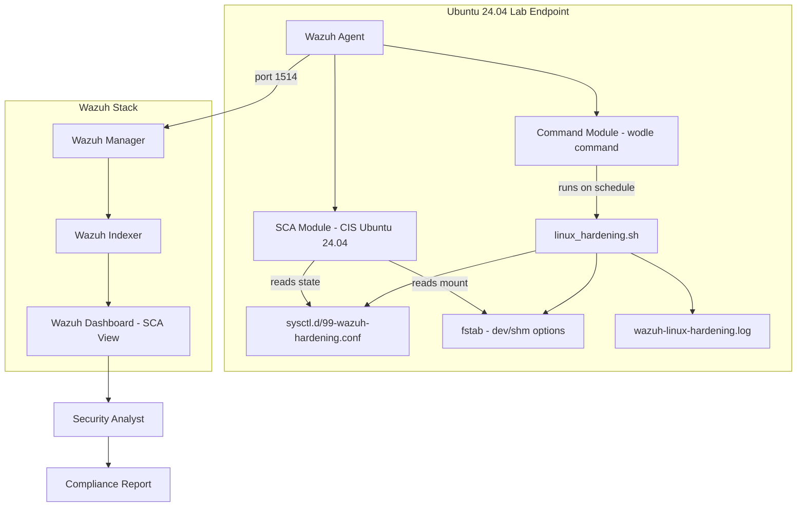

# 02 — Lab Architecture

## Component Overview

| Component | Role |
|-----------|------|
| **Wazuh Manager** | Receives SCA results, orchestrates Command Module, generates alerts |
| **Wazuh Indexer** | Stores SCA events and status change alerts (OpenSearch) |
| **Wazuh Dashboard** | SCA result visualization, before/after comparison |
| **Ubuntu 24.04 Endpoint** | Hardening target — runs Wazuh Agent, NGINX (optional), standard services |
| **Wazuh SCA Module** | Reads CIS Ubuntu 24.04 policy; evaluates each check against system state |
| **Wazuh Command Module** | Executes `linux_hardening.sh` on schedule via `wodle name="command"` |
| **linux_hardening.sh** | Idempotent Bash script that applies sysctl and mount hardening |
| **validate_hardening_state.sh** | Manual validation script — tabular output of current control state |
| **CIS Ubuntu 24.04 Policy** | Built-in Wazuh SCA policy (cis_ubuntu24-04_L1.yml) |

---

## Architecture Diagram



---

## Lab Environment

| Item | Value |
|------|-------|
| Wazuh Server | OVA v4.x |
| Ubuntu Endpoint | Ubuntu 24.04 LTS (lab VM) |
| Wazuh Agent | v4.x — Active |
| SCA Policy | CIS Ubuntu Linux 24.04 Benchmark |
| Network | Isolated host-only |
| Snapshot | Required before any hardening |
| Script location | `/var/ossec/active-response/bin/linux_hardening.sh` |
| Hardening log | `/var/log/wazuh-linux-hardening.log` |
| Sysctl config | `/etc/sysctl.d/99-wazuh-hardening.conf` |

---

## Data Flow

```
[1] Wazuh Agent starts → SCA module reads CIS Ubuntu 24.04 policy
[2] Each check evaluates: sysctl values, mount options, file content, service state
[3] Results: passed / failed / not_applicable
[4] SCA summary → Wazuh Manager → Wazuh Indexer → Dashboard

[Hardening path]
[5] Command Module fires (on start + every 12h)
[6] linux_hardening.sh runs as root
[7] Script checks current state → applies only what is non-compliant
[8] Changes written to /etc/sysctl.d/99-wazuh-hardening.conf
[9] sysctl --system applies changes immediately
[10] fstab updated for /dev/shm (if not already configured)
[11] Log written to /var/log/wazuh-linux-hardening.log

[Next SCA scan]
[12] SCA re-evaluates all checks → previously failed checks now pass
[13] Status changed events generated (previous_result: failed → result: passed)
[14] Dashboard shows improved score
[15] Analyst collects before/after evidence → generates report
```
